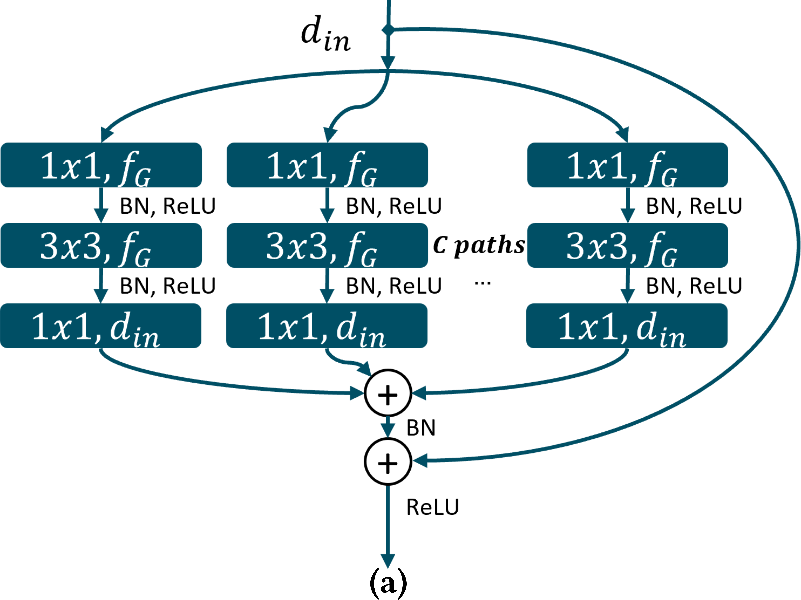
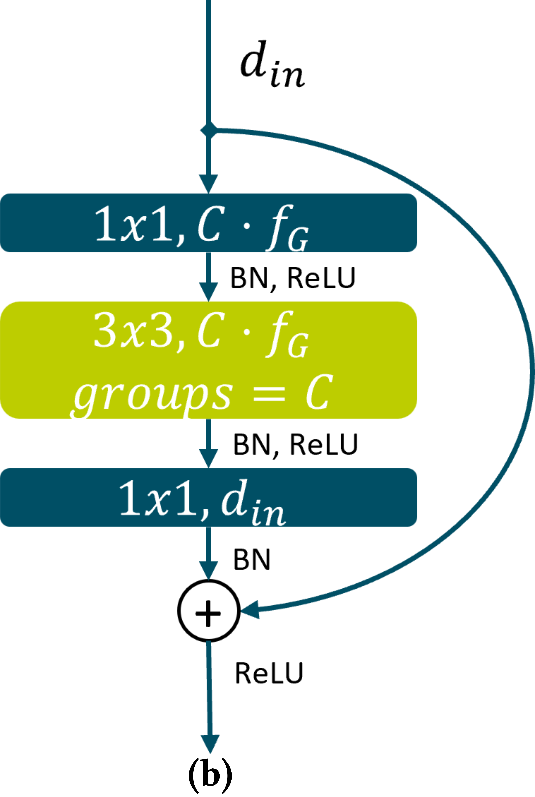
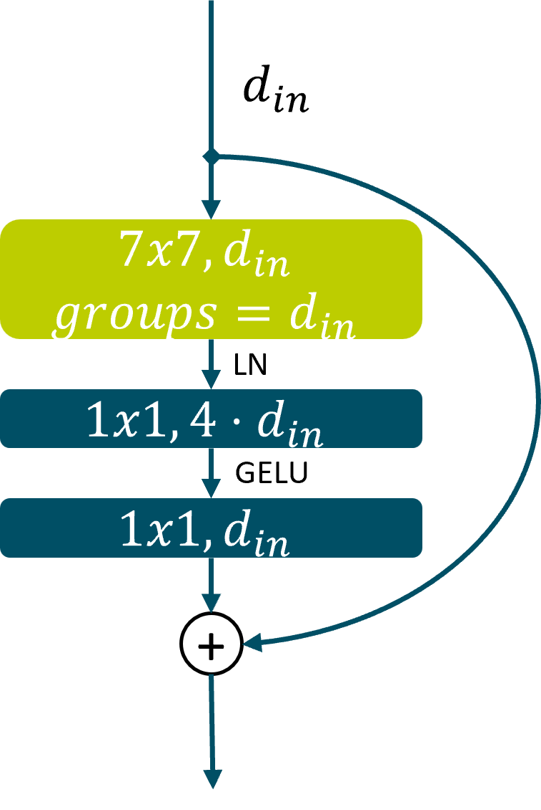
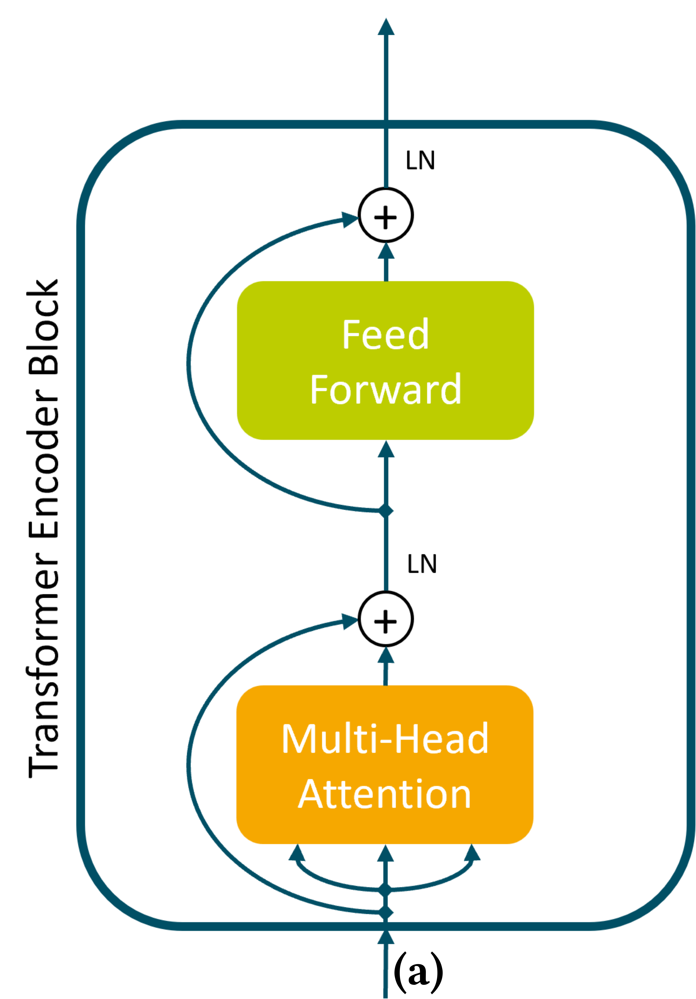
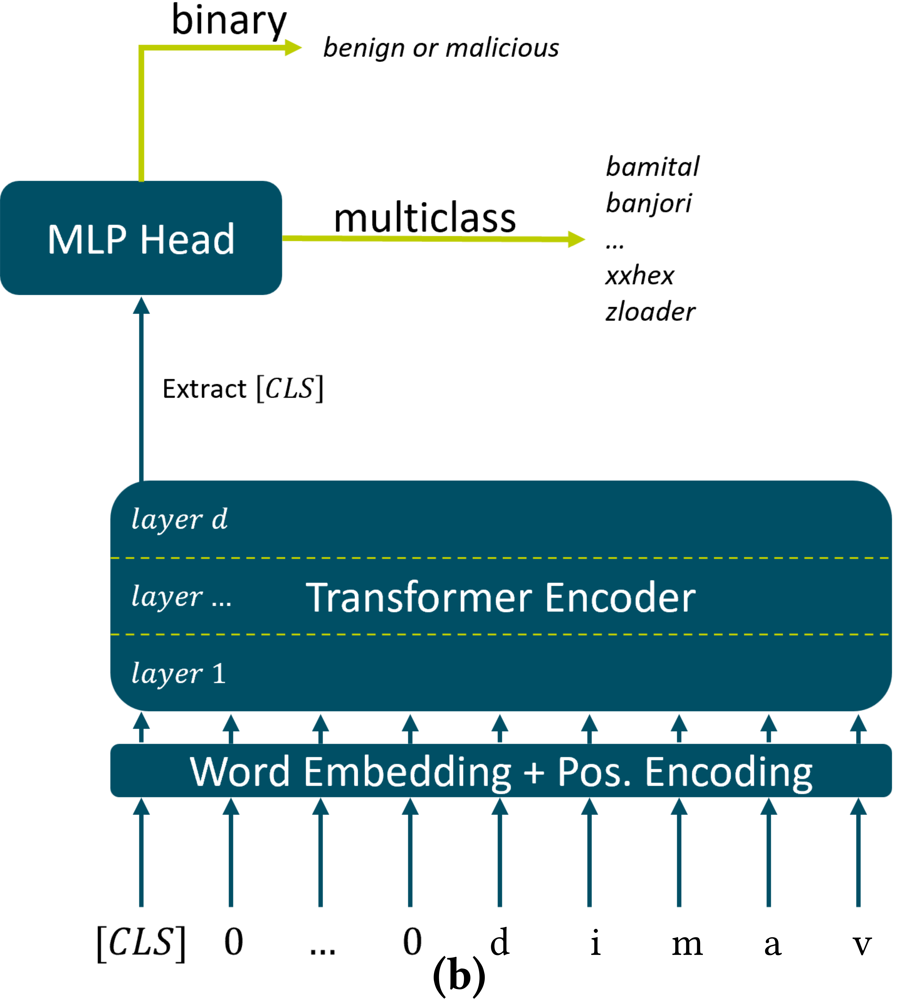
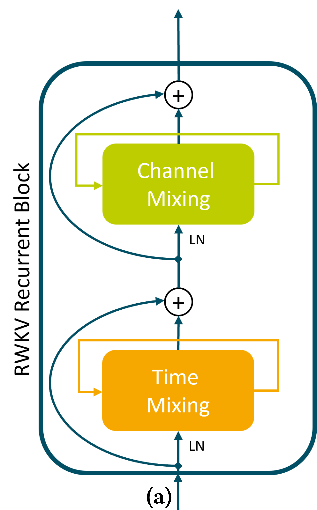

# A Transfer Learning-based Training Approach for DGA Classification

This is cloned repository of the submitted short-paper: "A Transfer Learning-based Training Approach for DGA Classification". [Original repository](https://gitlab.com/rwth-itsec/dga-transfer-learning-based-training)

The repository contains the code for the TL-based training procedure and the four novel optimized models for both the binary and multiclass classification task.  
Additionally, we provide the code of the compared state-of-the-art model [1] based on ResNet and added training demonstration scripts to encourage replication studies and facilitate future work.   

The optimized models are based on:

- ResNeXt [2]
- ConvNeXt [3]
- Transformer [4], using a BERT-like architecture [5] 
- RWKV [6]

## Model Implementations
The implementation of the DGA models can be found in the corresponding files inside the `models` folder.  
For each classifier, the binary (`_binary`) and multiclass (`_mcc`) implementation is provided.  
The hyperparameters we used for our hyperparameter optimization of the evaluated models are provided in `models/hyperparameters.py`.

## Training and Evaluation
To test our proposed models as well as the proposed transfer learning-based training procedure, we have added the scripts `poc_binary.py` and `poc_mcc.py`.

Testing the **binary** classifiers can be done by first embedding your own dataset in the `poc_binary.py` script, using the same data format as shown in the file.  
To train the model, run `python poc_binary.py --model <model>` and select one of the following models: 
`{resnet, resnext, convnext, transformer, rwkv}`.

For transfer learning, append the `--tl` flag. Note that a different data structure (dictionary with multiclass labels) is required for transfer learning.

Similar to the binary classifiers, to run the **multiclass** counterparts, you must first embed your data in `poc_mcc.py` and run `python poc_mcc.py --model <model>` with the desired model.

## Model Descriptions

### ResNeXt
To increase the performance of the original ResNet models, Xie et al. propose the ResNeXt architecture [2] using their proposed ResNeXt blocks (see Fig. 1 (a)).
It replaces the triple sequence of convolutional layers inside the bottleneck-blocks of a traditional ResNet into *C* different paths holding a triple sequences of convolutional layers.
Each of them retain the same kernel size but have a smaller amount of filters.
Then, all the parallel layers are aggregated after which the skip connection is aggregated as well.
The same effect can be achieved by using a grouped convolution layer (Fig.1 (b)).
With this change in design, the authors show that increasing the cardinality (number of paths, referred to as *C* in Fig. 1) is more effective than going deeper or wider as done in Wide ResNets [7].

<figure>

  
   

<figcaption>Fig.1: Schematic of a ResNeXt block: (a) Demonstrates the meaning of the cardinality <b>C</b> and the width <b>fG</b> of each path.
              In (b) a grouped convolutional layer is used instead. Both (a) and (b) are equivalent.</figcaption>

</figure>

For DGA classification, we replace the 2D-convolutional layers with their 1D counterparts and arrange the the ResNeXt blocks similar to the architectures of the state-of-the-art B-/M-ResNet model [1].
The actual model layout, however, is optimized during a hyperparameter optimization.
There, we optimize the cardinality *C*, the number of filters inside each group $f_G$ and the depth.

### ConvNeXt
Liu et al. propose ConvNeXt networks and with it the ConvNeXt blocks (see Fig. 2) [3].
Compared to ResNeXt blocks (Fig. 1 (b)), the grouped convolution layer is moved to the top of the ConvNeXt block, the kernel size is enlarged, and the number of groups is identical to the input channel dimension to be able to use a depthwise convolution.
Here, each channel is individually processed by its own filter, after which all filter maps are stacked on each other.
Additionally, instead of decreasing the channel dimensionality first (as done in traditional bottleneck blocks), they propose the use of an inverted bottleneck where the dimensionality is expanded four times after which it is decreased back to the original size.
Further, they replace the batch normalization by a layer normalization (LN) and the ReLU activation function by the Gaussian Error Linear Unit (GELU).

<figure>

  

  
  

  <figcaption>Fig.2: Schematic of a ConvNeXt block.</figcaption>

</figure> 

Similar to the ResNeXt model, we modify the blocks to process one-dimensional sequential data for DGA classification.
We optimize the depth of the model and the number of filters (input dimension $d_{in}$) of the ConvNeXt blocks to find an optimal model.

### Transformer

Transformer blocks were first introduced by Vaswani et al. in 2017 [4].
One of their central concepts is the use of attention mechanisms which are used in the Multi-Head Attention (MHA) layer inside Transformer Encoder blocks (see Fig.3 (a)).
First, the input is processed by the MHA layer which consists of *h* stacked self-attention heads that can attend to all input tokens independently.
After that layer, the skip connection is added and a layer normalization (LN) is applied.
The next layer, the feed forward layer, consists of two linear layers separated by a ReLU activation.
Again the output of it is added to the skip connection and a LN is applied.

Unlike typical convolutional or recurrent neural networks, the embedded input text is processed independently of its position within the Multi-Head Attention layer.
Therefore, the relative and absolute positional information of the input sequence is naturally lost.
To compensate for this loss, a positional encoding consisting of a sine and cosine function is added to the embedded input tokens before they are processed by the Transformer blocks.

A popular transformer model is the "Bidirectional Encoder Representations from Transformers" (BERT) [5].
The BERT model can not only be used to predict the next words/tokens of a sentence, but also to classify text (e.g., for sentiment analysis).
Similar to Fig. 3 (b), a [CLS] token is prepended to the tokenized text.
These tokens then receive a Word and Positional Embedding which will be processed by a Transformer Encoder.
Afterwards, the processed [CLS] token is extracted and fed into a classification head, which dependent on the desired task predicts the next token or classifies the processed text.

<figure>

  
   

<figcaption>Fig.3: Transformer Encoder block (a) and their use inside a BERT-similar classifier for DGA classification (b).</figcaption>

</figure>

This technique can be applied to DGA classification where the Transformer-based classifier receives the domain name characters as an input, applies positional encoding and embeds the characters.
After processing by the Transformer Encoder, the extracted [CLS] token is also classified by a Multi-Level-Perceptron (MLP) layer which outputs either a single probability for the binary case using a sigmoid activation function or the result of a multinomial logistic regression in the multiclass setting by using a softmax activation function.
Since the concept of the BERT model is intended to be used on sequential data, there are no major model modifications to be made and the model can be used as shown in Fig. 3 (b).
The model-specific hyperparameters to consider during the hyperparameter optimization are the depth, the dimensionality of the hidden Transformer Encoder layers used by the MHA and Feed Forward layer and the number of heads inside the MHA.

### RWKV

In RWKV models [6] the Multi-Head Attention of the Transformer blocks is replaced by a Time Mixing layer and the Feed Forward layer by a Channel Mixing layer (see Fig. 4 (a)).
In the Time Mixing layer, a linear attention mechanism is used to overcome the quadratic time and memory complexity of the traditional attention mechanism used in Transformers.
The Time and Channel Mixing layers proposed by the authors only process the previous tokens (similar to Masked MHA) and can therefore be used in both recurrent and non-recurrent forms.
This allows RWKV models (similar to the original Transformer model) to be trained in parallel and the trained model to be reformulated as a pure Recurrent Neural Network (RNN) for inference, drastically reducing time and memory complexity.
Thereby, the authors are able to take advantages of both Transformer and RNN models while overcoming the high time and memory complexity, the limiting factor of Transformers, and the vanishing gradient problem and non-parallelizable training of RNNs.

<figure>

  
   

  <figcaption>Fig.4: Schematic of a RWKV recurrent block and the use in a parallel and recurrent RWKV model: 
              (a) RWKV Block in a recurrent configuration. The right angled arrows depict the recurrent data flow.
              (b) Top figure shows a parallel RWKV model. For DGA classification, the context of all characters is required thus real parallelization cannot be used here.
                  Lower figure shows an equivalent recurrent RWKV model. </figcaption>

</figure> 

For DGA classification, the RWKV blocks can be used similarly to the Transformer based classifier to encode the domain character by character, after which they are classified by a classification head.
However, because of the recurrent formulas of the RWKV blocks, there is no need for a positional encoding or a dedicated classification token, as the final prediction can be done using the output of the last character.
The MLP Head is similar to the other architectures, however as proposed by Peng et al. [6], in the multiclass case, the softmax activation function is replaced by a log softmax activation function.

Since the original RWKV model is used to generate text, there are some adjustments necessary for DGA classification.
First, as shown in Fig. 4 (b), the parallel training mode cannot be used.
Normally, RWKV models are trained to predict the next token for each of the tokens based on the previously processed tokens.
Therefore, RWKV models can originally be trained in a parallelizable way.
However, for classification, it is only possible to classify the sequence of tokens after all tokens have been processed, which makes it necessary to modify the model and the training process.
This is done by only using the output of the last RWKV block as an input to the classification head.
The model-specific hyperparameters to be tuned are the depth and the internal RWKV block dimensionality (which corresponds to the initial character embedding size).

### Optimized Hyperparameters

| Hyperparameters        | B/M-ResNet    | B/M-ResNeXt    | B/M-ConvNeXt   | B/M-Transformer | B/M-RWKV       |
|------------------------|---------------|----------------|----------------|-----------------|----------------|
| Depth                  | 1 / 11        | 3 / 12         | 3 / 13         | 2/4             | 4/4            |
| Cardinality            | -             | 4/4            | -              | -               | -              |
| Number of filters      | 128 / 256     | 512 / 512      | 128 / 64       | -               | -              |
| Number of heads        | -             | -              | -              | 8/9             | -              |
| Hidden dim             | -             | -              | -              | 128 / 32        | -              |
| Embedding Size         | 128 / 128     | 128 / 256      | 128 / 512      | 128 / 256       | 128 / 128      |
| MLP Head               | 0/0           | 64 / 128       | 256 / 0        | 0/0             | -              |
| Learning Rate          | 0.001 / 0.001 | 0.001 / 0.0001 | 0.0005 / 0.001 | 0.001 / 0.0001  | 0.001 / 0.0001 |
| Batch Size             | 128 / 256     | 256 / 32       | 64 / 64        | 256 / 32        | 128 / 128      |
| #Parameters_binary     | 138,369       | 2,968,577      | 928,769        | 212,865         | 859,648        |
| #Parameters_multiclass | 3,218,031     | 8,338,031      | 495,023        | 1,211,583       | 859,776        |

## References 

[1] A. Drichel, U. Meyer, S. Schüppen, and D. Teubert.  
Analyzing the Real-World Applicability of DGA Classifiers.  
In The 15th International Conference on Availability, Reliability and Security (ARES 2020).  
ACM, 2020. https://doi.org/10.1145/3407023.3407030.

[2] S. Xie, R. Girshick, P. Dollár, Z. Tu, and K. He  
Aggregated Residual Transformations for Deep Neural Network.  
In Computer Vision and Pattern Recognition (CVPR 2017).  
IEEE, 2017. https://openaccess.thecvf.com/content_cvpr_2017/papers/Xie_Aggregated_Residual_Transformations_CVPR_2017_paper.pdf

[3] Z. Liu, H. Mao, C.-Y. Wu, C. Feichtenhofer, T. Darrell, and S. Xie  
A ConvNet for the 2020s.  
In Computer Vision and Pattern Recognition (CVPR 2022).  
IEEE, 2022. https://openaccess.thecvf.com/content/CVPR2022/papers/Liu_A_ConvNet_for_the_2020s_CVPR_2022_paper.pdf

[4] A. Vaswani, N. Shazeer, N. Parmar, J. Uszkoreit, L. Jones, A. N. Gomez, Ł. Kaiser, and I. Polosukhin.  
Attention is all you need.  
In Advances in Neural Information Processing Systems. vol. 30 (2017)  
Curran Associates, Inc., 2017 https://proceedings.neurips.cc/paper_files/paper/2017/file/3f5ee243547dee91fbd053c1c4a845aa-Paper.pdf

[5] J. Devlin, M.-W. Chang, K. Lee, and K. Toutanova  
BERT: Pre-training of Deep Bidirectional Transformers for Language Understanding.   
<i>arXiv e-prints</i>, 2018.   
https://doi.org/10.48550/arXiv.1810.04805.

[6] Peng, B. et al.   
RWKV: Reinventing RNNs for the Transformer Era.  
<i>arXiv e-prints</i>, 2023.   
https://doi.org/10.48550/arXiv.2305.13048.

[7] S. Zagoruyko, and N. Komodakis   
Wide Residual Networks   
<i>arXiv e-prints</i>, 2016.   
https://doi.org/10.48550/arXiv.1605.07146.
